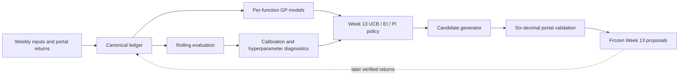

# Canonical artefacts and historical records

Use this map to avoid treating a convenient copy or an old weekly snapshot as
the current source of truth.

## Canonical final artefacts

| Question | Canonical artefact |
| --- | --- |
| Where should a new reader start? | `Final_Report/START_HERE_Final_Report.ipynb` |
| What query/return evidence is verified? | `Results/query_output_ledger.csv` and its `.sha256` file |
| What were the frozen Week 13 decisions? | `Week_13/02_Notebook/Week_13_Optimisation_Strategy.ipynb`, `Week_13/01_Queries/week_13_query_points.txt`, and `Week_13/04_Results/week_13_strategy_summary.csv` |
| What is the final model evaluation? | `Notebooks/GP_Evaluation_and_Calibration.ipynb` and `Results/gp_*` CSV files |
| What is the compact final result? | `Final_Report/final_scoreboard.csv` and `Final_Report/incumbent_timeline.csv` |
| How is the release reproduced? | `REPRODUCIBILITY.md`, `Documentation/REPRODUCIBILITY.md`, and `Code/run_frozen_repository.py` |
| What AI assistance was used? | `Documentation/AI_USE_DISCLOSURE.md` |

The current final evidence boundary is **Weeks 1–13 observed**: 104 verified
weekly pairs. Week 13 proposals were generated and frozen from the earlier
96-pair Weeks 1–12 boundary, then the eight Week 13 returns were appended
prospectively. These two statements describe different points in the audit trail
and are not contradictory.

## Historical records

- `Week_01/` through `Week_12/` preserve the chronological campaign record.
- Weekly `Function_01/` through `Function_08/` folders provide function-specific
  teaching and reflection views; they do not override the canonical ledger.
- `Results/archive/` contains superseded ledgers and proposal drafts. In
  particular, the pre-Week-12-evidence GP-UCB proposal set is historical only.
- Earlier release tags preserve immutable stages of the evidence sequence.

The final submitted evidence state is frozen by `capstone-final-v1.0.11`.
Anything developed after that release must be labelled post-submission or future
work and must not replace the canonical Week 13 evidence.

Historical files should be cited when explaining how the work evolved. They
should not be used to recompute the final scoreboard unless the purpose is an
explicit historical comparison.

## Evidence and modelling flow

The return edge is dashed because it occurred after the Week 13 proposal set
was frozen. This prevents later outcomes from leaking into the recorded choice.
