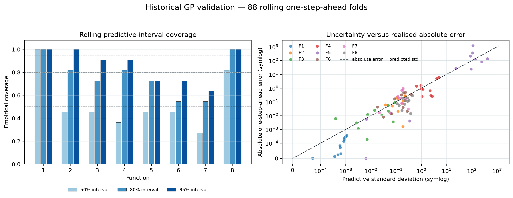

# Evaluation: optimisation, surrogate calibration, and robustness

## Evaluation questions

The capstone has three related but non-interchangeable evaluation targets.

| Evaluation target | Question | Evidence | What it cannot establish |
| --- | --- | --- | --- |
| Optimisation performance | Did a returned query improve the within-function incumbent? | Immutable returned-pair ledger and best-so-far trajectory | Predictive accuracy, calibrated uncertainty, or global optimality |
| Surrogate accuracy and calibration | Does a GP trained on the historical prefix predict the next return, and do predictive intervals cover at nominal rates? | 104 one-step-ahead rolling folds | Independent-distribution generalisation or recommendation quality |
| Recommendation policy | Why was each Week 13 acquisition selected before outcomes? | Pre-outcome function-specific UCB/EI/PI record | A statistically controlled acquisition comparison |

Keeping these targets separate prevents a high predicted value from being called
an optimisation success and prevents a stable recommendation from being called
an accurate model.

## Optimisation performance

Across the 104 verified weekly returned pairs, twelve established a new
within-function incumbent. Week 13 contributed two: F5 (`+893.930245`) and F6
(`+0.131829`). The resulting raw improvement rate is `12/104 = 11.5%`.
This descriptive rate is conditional on different functions, strategies, and
adaptive histories; it is not a controlled comparison of acquisition methods.
EI happened to produce two improvements among its three Week 13 assignments,
but this cannot establish EI superiority because method assignment was adaptive,
heterogeneous, and non-randomised.

Best observed values after Week 13 are approximately `7.710875e-16`,
`0.6112052`, `-0.02262932`, `0.3699753`, `4440.562`, `-0.4059929`, `2.266802`,
and `9.939904` for F1–F8. They are incumbents, not proven global optima.

## Rolling historical GP validation

For each function, the starter data train the first GP. Each historical returned
query is then predicted using only observations available before that return;
the true value is held out, scored, appended, and the process repeats. This
creates thirteen chronological folds per function and 104 folds in total without
look-ahead leakage. Every fold refits a Matérn-5/2 GP with target normalisation,
the canonical kernel bounds, one optimiser restart, and a deterministic seed.

| Function | RMSE | Mean-baseline RMSE | RMSE skill | Mean NLPD | 50% coverage | 80% coverage | 95% coverage |
| --- | ---: | ---: | ---: | ---: | ---: | ---: | ---: |
| F1 | 0.000172 | 0.000246 | 0.303 | -6.479 | 1.000 | 1.000 | 1.000 |
| F2 | 0.138203 | 0.209988 | 0.342 | -0.735 | 0.462 | 0.846 | 1.000 |
| F3 | 0.031631 | 0.050953 | 0.379 | 6.173 | 0.385 | 0.769 | 0.923 |
| F4 | 2.327732 | 10.286353 | 0.774 | 2.380 | 0.308 | 0.692 | 0.769 |
| F5 | 599.720417 | 1555.969259 | 0.615 | 13.161 | 0.385 | 0.615 | 0.615 |
| F6 | 0.235192 | 0.614125 | 0.617 | -0.297 | 0.462 | 0.615 | 0.769 |
| F7 | 0.428498 | 1.055977 | 0.594 | 1.922 | 0.231 | 0.462 | 0.692 |
| F8 | 0.127484 | 1.400150 | 0.909 | -0.445 | 0.846 | 1.000 | 1.000 |

All eight functions have positive RMSE skill relative to predicting the historical
training mean. Raw RMSE is reported within each function only because objective
scales differ. With thirteen folds, one miss moves coverage by 7.7 percentage points.
F5–F7 materially under-cover at 95%. F1, F2, and F8 over-cover, indicating
conservative intervals. These are calibration diagnostics, not claims that one
function is easier or more important.

The prospective Week 13 returns provide a particularly clear calibration check:
F4 and F5 had relatively large standardised predictive errors of about `-2.88`
and `+2.07` predictive standard deviations. The GP therefore provided useful
predictive structure without being uniformly well calibrated.

Mean negative log predictive density (NLPD) evaluates the full predictive
distribution: lower values reward concentrated probability around realised
returns, while large positive values penalise overconfident misses. NLPD is
scale-sensitive and is interpreted within each function, alongside RMSE and
coverage rather than as a cross-function ranking.

## Fitted GP hyperparameters

Final models use the canonical post-Week-13 counts and three optimiser restarts.
The length-scale vector is anisotropic and follows input-coordinate order.

| Function | Constant | Length scales | Noise | Parameters at bounds |
| --- | ---: | --- | ---: | --- |
| F1 | 1.37862 | `[2.000, 0.0446]` | `1.27e-10` | L1 upper |
| F2 | 0.67869 | `[0.0469, 2.000]` | `1e-2` | L2 upper; noise upper |
| F3 | 1.90080 | `[2.000, 1.812, 0.0787]` | `0.00219` | L1 upper |
| F4 | 15.44259 | `[1.846, 1.861, 1.892, 1.906]` | `0.00204` | none |
| F5 | 2.75750 | `[2.000, 0.368, 0.915, 2.000]` | `1e-10` | L1/L4 upper; noise lower |
| F6 | 4.37092 | `[1.331, 0.874, 1.174, 1.797, 2.000]` | `0.00113` | L5 upper |
| F7 | 0.63506 | `[0.686, 0.443, 1.072, 0.412, 0.307, 0.789]` | `1.06e-10` | none |
| F8 | 0.92621 | `[1.245, 2.000, 1.016, 2.000, 2.000, 2.000, 1.309, 2.000]` | `1e-10` | L2/L4/L5/L6/L8 upper; noise lower |

Six final fits reach at least one configured bound; F4 and F7 do not. Upper-bound length scales imply that
the fitted surface is very smooth along those coordinates relative to the
configured domain; they do not prove irrelevance. Noise at the lower bound means
the model estimates negligible independent noise under its assumptions, not that
the objective is known to be noiseless. F2's upper-bound noise estimate and F8's
five upper-bound length scales are particularly important modelling diagnostics.
Wider-bound sensitivity is therefore reported separately rather than used to
rewrite the submitted Week 12 experiment.

## Week 13 acquisition justification

Before any Week 13 outcomes, UCB was selected for F1/F4/F7/F8 to retain
uncertainty-led exploration, EI for F2/F5/F6 to balance improvement around
promising Week 12 regions, and PI for F3 for controlled exploitation after its
new incumbent. The policy is adaptive and heuristic. It is not randomised and
does not provide a statistically controlled comparison among acquisition rules.
The diagnostics in the Week 13 strategy and acquisition-comparison files are
evaluated at the exact six-decimal coordinates submitted to the portal.

## Week 13 boundary-generation sensitivity

The frozen proposals remain unchanged. A diagnostic rerun replaced clipped
Gaussian local perturbations with reflected perturbations while holding the GP,
seeds, Sobol candidates, counts, scales, evidence, and acquisition rules fixed.
F2, F5, and F6 no longer selected an exact boundary coordinate under reflection.
F5 remained very close to its three upper boundaries (`0.999459`, `0.996407`,
`0.988539`) and only `0.0204` Euclidean distance from the frozen query, so its
boundary-region recommendation is substantively robust even though the exact
boundary values are partly induced by clipping. F2 and F6 moved materially.
Full results are in [`week_13_boundary_generation_sensitivity.csv`](../Week_13/04_Results/week_13_boundary_generation_sensitivity.csv).

## Limitations and judgement

- The 104 folds are chronological and leakage-free but arise from adaptive,
  non-random queries; they are not an independent test distribution.
- Thirteen folds per function give coarse coverage estimates.
- Hyperparameter fitting sometimes produces convergence warnings and boundary
  estimates, indicating weak identification or restrictive bounds.
- RMSE is meaningful only within a function; calibration coverage and
  standardised residuals are more comparable across scales.
- Absolute regret is unavailable because the true functions and optima are
  unknown.

Overall, the evaluation is ready to share with these caveats. It demonstrates
predictive value for most functions, identifies material calibration failures,
and keeps recommendation sensitivity distinct from returned optimisation gains.
